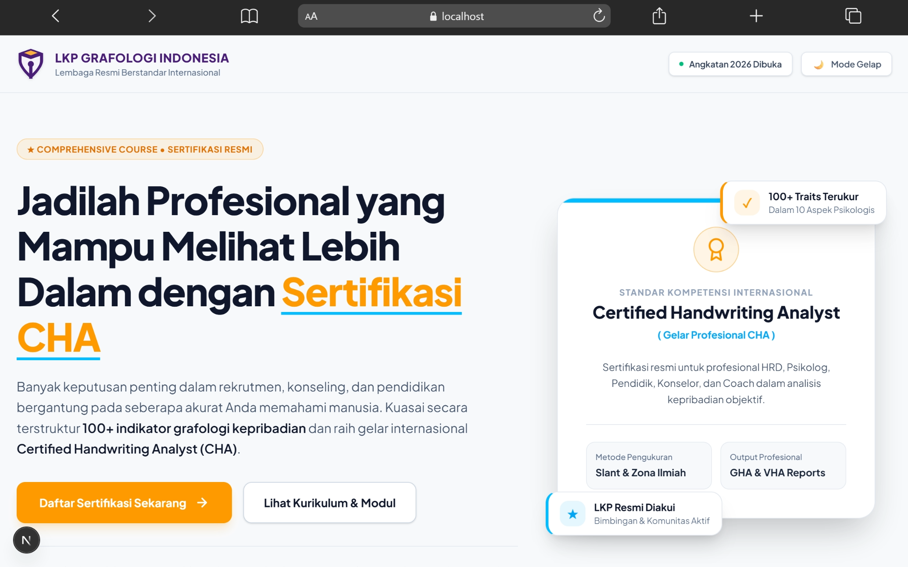
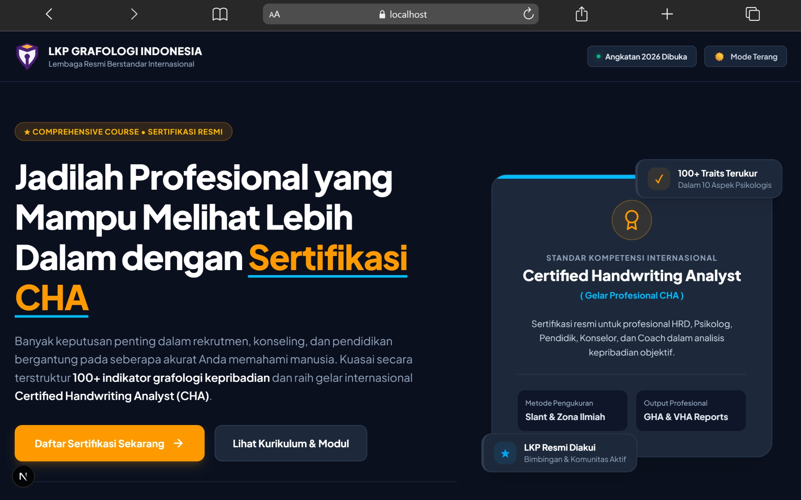

# 🎖️ Redesign Hero Section | Sertifikasi Grafologi CHA

**Lembaga Resmi Berstandar Internasional LKP Grafologi Indonesia**


---

## 👤 Pengembang & Desainer

| Informasi                     | Keterangan |
| :---------------------------- | :---------- |
| **Nama**                      | Syahiid Bani Putra |
| **Peran**                     | UI/UX Designer & Web Developer |
| **Portofolio**                | [syahiid-bani-putra.vercel.app](https://syahiid-bani-putra.vercel.app/) |
| **LinkedIn**                  | [linkedin.com/in/syahiidbaniputra](https://www.linkedin.com/in/syahiidbaniputra/) |
| **Website Referensi**         | [LKP Grafologi Indonesia - Comprehensive Course](https://grafologiindonesia.com/kursus/comprehensive/) |
| **Website Hasil Redesign**    | [LKP Grafologi Indonesia - Redesign Hero Section](https://redesign-hero-section-syahiid-bani-putra.vercel.app/) |

---

## 💡 Ringkasan Proyek

Proyek ini merupakan studi kasus redesign (perancangan ulang) pada antarmuka **Hero Section** website LKP Grafologi Indonesia untuk program kursus komprehensif **Sertifikasi CHA (Certified Handwriting Analyst)**.

Tujuan utama dari redesign ini bukan sekadar menyalin desain referensi, tetapi menciptakan **interpretasi visual baru yang lebih modern, profesional, dan berfokus pada pengalaman pengguna serta konversi**. Dalam prosesnya, saya tetap mempertahankan fakta utama produk, yaitu Kursus Grafologi, penguasaan lebih dari 100 traits, dan gelar Sertifikasi Internasional CHA.

---

## 🖥️ Preview Hasil Redesign

### ☀️ Light Mode

<p align="center">
  
</p>

### 🌙 Dark Mode

<p align="center">
  
</p>

## ✨ Fitur & Keunggulan Desain

* **🏗️ Split-Screen Executive Layout:** Mengubah tata letak vertikal konvensional menjadi struktur 2 kolom (*55:45 split-screen*). Kolom kiri digunakan untuk menyampaikan pesan utama dan informasi kursus, sedangkan kolom kanan memperkuat informasi tersebut melalui visual seperti representasi sertifikat CHA dan kartu fitur.

* **🎨 Clean Solid UI & Professional Geometry:** Mengurangi penggunaan gradien yang berlebihan dan beralih ke warna solid yang lebih bersih dengan border yang halus. Saya juga mengurangi penggunaan bentuk kapsul atau oval yang terlalu umum pada desain berbasis AI dan menggunakan geometri yang lebih presisi dengan *rounded rectangle* 8px agar tampilan terasa lebih rapi dan profesional.

* **🌗 Light / Dark Mode:** Menambahkan fitur Light Mode dan Dark Mode interaktif menggunakan `next-themes` dan Tailwind CSS. Fitur ini ditujukan untuk memberikan pengalaman visual yang lebih nyaman dalam berbagai kondisi pencahayaan dan sesuai dengan preferensi pengguna.

* **⚡ Hybrid Adaptive Logo & Vektor SVG:** Menggunakan ikon SVG dari logo asli LKP Grafologi Indonesia agar tetap tajam pada berbagai resolusi layar. Warna teks logo juga disesuaikan secara dinamis berdasarkan tema, menggunakan warna putih pada Dark Mode dan warna ungu brand asli `#4A1E78` pada Light Mode.

* **🎯 Dual-CTA & Trust Indicators:** Menerapkan dua pilihan CTA, yaitu "Daftar Sekarang" sebagai CTA utama dan "Lihat Kurikulum" sebagai CTA sekunder. Di bawah tombol tersebut, saya menempatkan *Trust Indicators* seperti 13+ Modul Resmi, 20x Webinar, dan Akses Seumur Hidup untuk memberikan informasi pendukung yang dapat membantu pengguna dalam mengambil keputusan.

---

## 🛠️ Teknologi yang Digunakan

* **Framework:** [Next.js](https://nextjs.org/) (*App Router*)
* **Bahasa:** [TypeScript](https://www.typescriptlang.org/) (*Strict Typing*)
* **Styling:** [Tailwind CSS](https://tailwindcss.com/) (*Utility-first CSS Framework*)
* **Theming:** `next-themes` (*Client-side dynamic theme switcher*)
* **Tipografi:** Google Fonts (`Plus Jakarta Sans`) melalui `next/font`
* **Ikonografi:** Vektor SVG Kustom & Lucide Icons

---

## 🚀 Cara Menjalankan Proyek secara Lokal

1. **Clone repositori ini ke komputer:**

   ```bash
   git clone [URL-Repository-GitHub]
   cd grafologi-redesign
   ```

2. **Install seluruh dependensi proyek:**

   ```bash
   npm install
   ```

3. **Jalankan development server:**

   ```bash
   npm run dev
   ```

4. **Buka di browser:**

   Akses `http://localhost:3000` untuk melihat hasil redesign yang sudah berjalan secara lokal.

---

## 📌 Catatan

Proyek ini dibuat sebagai bagian dari tugas **Web Development (Redesign)** dengan fokus pada perancangan ulang **Hero Section** dari website LKP Grafologi Indonesia. Saya menggunakan halaman asli sebagai referensi, kemudian mengembangkan interpretasi desain saya sendiri dengan melakukan perubahan pada layout, visual, tipografi, serta pendekatan UI/UX, tanpa mengubah fakta inti dari produk yang ditawarkan.

Dalam proses pengerjaannya, **AI digunakan sebagai alat bantu** untuk mengeksplorasi ide desain, memberikan masukan terkait struktur layout, serta membantu proses pengembangan dan penyempurnaan kode. Namun, keputusan akhir terkait arah desain, pemilihan layout, penyesuaian konten, penggunaan warna, serta modifikasi UI/UX saya tentukan dan sesuaikan sendiri berdasarkan hasil analisis terhadap website referensi dan kebutuhan dari tugas.

Implementasi akhir kemudian dikembangkan menggunakan **Next.js (App Router) dan Tailwind CSS** sebagai pendekatan teknis yang saya pilih untuk membangun hasil redesign agar dapat langsung dilihat dan diuji dalam bentuk website yang berjalan.
